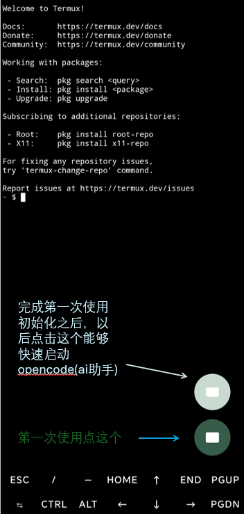

# OpenHouse 用户使用说明

这份说明是写给普通用户的。

你不需要理解技术细节，也不需要自己解释系统是什么。

你只需要做一件事：把下面这段话复制给 AI。

## 什么时候要这样做

以下情况都可以直接复制下面这段话发给 AI：

- 第一次使用
- 更换了新的 AI
- 更换了新的模型
- AI 看起来不理解当前系统
- AI 回答得很乱，像是不知道环境在哪里

## 建议使用更强的模型

如果你可以选择模型，建议优先使用能力更强的模型。

特别是下面这些情况，更建议使用强模型：

- 第一次引导
- 安装 Ubuntu
- 安装或启动 OpenCode
- 排查错误

能力弱的模型更容易看不懂环境，也更容易把步骤做错。

## OpenCode 默认地址

OpenCode 默认运行在这个地址：

```text
http://127.0.0.1:4096/
```

如果 AI 需要你提供 OpenCode 地址，直接把上面这一整段复制给它即可。

## 按钮说明

第一次使用完成初始化之后，可以先点击绿色按钮。

以后如果需要快速启动 OpenCode，可以点击白色按钮。



## 你只需要复制这段话

```text
你现在运行在 OpenHouse 环境中。

请先阅读下面这些文档，再继续回答我：

1. /data/data/com.termux/files/home/product-docs/official/START_HERE.md
2. /data/data/com.termux/files/home/product-docs/official/AGENT_GUIDE.md
3. /data/data/com.termux/files/home/product-docs/official/PATHS_AND_PORTS.md

如果有更短的路径，比如 ~/product-docs/official，请优先使用短路径读取同名文件。

读完后：

- 先用几句话总结你理解的环境
- 再继续回答我的问题
```

## 更短的版本

如果你只想发最短的一段，可以复制下面这段：

```text
请先阅读 OpenHouse 起始文档：

- /data/data/com.termux/files/home/product-docs/official/START_HERE.md
- /data/data/com.termux/files/home/product-docs/official/AGENT_GUIDE.md
- /data/data/com.termux/files/home/product-docs/official/PATHS_AND_PORTS.md

读完后先总结环境，再继续回答我。
```

## 如果还是不行

你可以先试这几件事：

- 把上面的内容再发一次
- 重新打开 AI 后再发一次
- 回到维护器确认服务已经启动
- 如果换了新的 AI，也重新发一次

## 你不需要自己解释

通常不需要你自己解释下面这些内容：

- 系统装在哪里
- 文档放在哪里
- Ubuntu 是什么
- OpenCode 地址是什么

这些都应该由 AI 先读文档后再理解。
